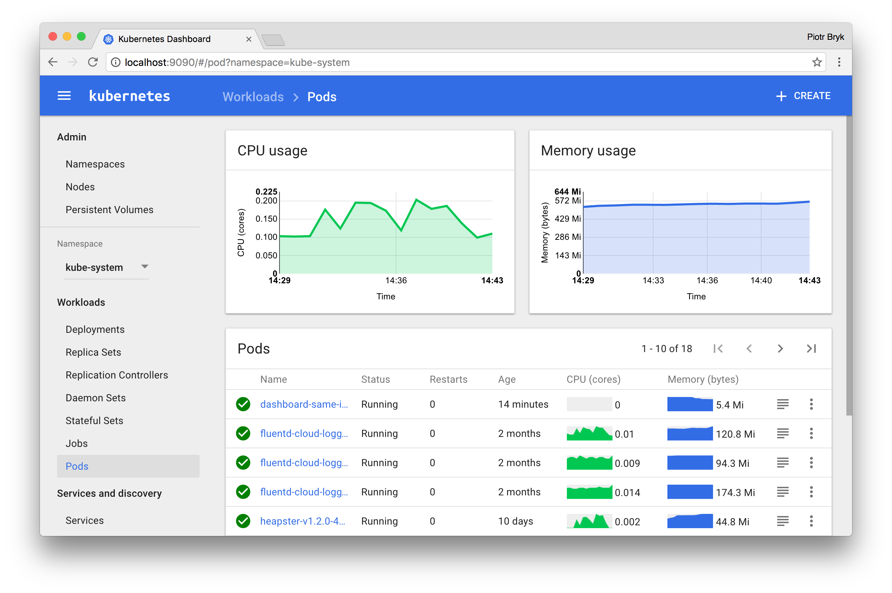

# Web UI (Dashboard)


### Dashboard is a web-based Kubernetes user interface. You can use Dashboard to deploy containerized applications to a Kubernetes cluster, troubleshoot your containerized application, and manage the cluster resources. You can use Dashboard to get an overview of applications running on your cluster, as well as for creating or modifying individual Kubernetes resources (such as Deployments, Jobs, DaemonSets, etc). For example, you can scale a Deployment, initiate a rolling update, restart a pod or deploy new applications using a deploy wizard.

### Dashboard also provides information on the state of Kubernetes resources in your cluster and on any errors that may have occurred.


# Deploying the Dashboard UI
### The Dashboard UI is not deployed by default. To deploy it, run the following command:
```bash
kubectl apply -f https://raw.githubusercontent.com/kubernetes/dashboard/v2.2.0/aio/deploy/recommended.yaml
```

### check dashboard service
```bash
kubectl get service -A
```
### Change ClusterIP to NodePort Service
```bash
kubectl -n kubernetes-dashboard patch svc kubernetes-dashboard --type='json' -p '[{"op":"replace","path":"/spec/type","value":"NodePort"}]'
```
### check dashboard service
```bash
kubectl get service -A
```
### Get Node port assigned to service
```bash
kubectl -n kubernetes-dashboard get services kubernetes-dashboard -o go-template='{{(index .spec.ports 0).nodePort}}'
```
### Creating a Service Account
```bash
cat <<EOF | kubectl apply -f -
apiVersion: v1
kind: ServiceAccount
metadata:
  name: admin-user
  namespace: kubernetes-dashboard
EOF
```

### Creating a ClusterRoleBinding
```bash
cat <<EOF | kubectl apply -f -
apiVersion: rbac.authorization.k8s.io/v1
kind: ClusterRoleBinding
metadata:
  name: admin-user
roleRef:
  apiGroup: rbac.authorization.k8s.io
  kind: ClusterRole
  name: cluster-admin
subjects:
- kind: ServiceAccount
  name: admin-user
  namespace: kubernetes-dashboard
EOF
```

### Getting a Bearer Token
Now we need to find the token we can use to log in. Execute the following command:
```bash
kubectl -n kubernetes-dashboard create token admin-user
```
### check objects
```bash
kubectl get pod,service,deployment -n kubernetes-dashboard
```
### Getting a Bearer Token
```bash
kubectl -n kubernetes-dashboard describe secret $(kubectl -n kubernetes-dashboard get secret | grep admin-user | awk '{print $1}')
```

### Kubernetes dashboard port forward:​
```bash
kubectl -n kubernetes-dashboard port-forward kubernetes-dashboard-<POD_ID> 8001:8443​
```