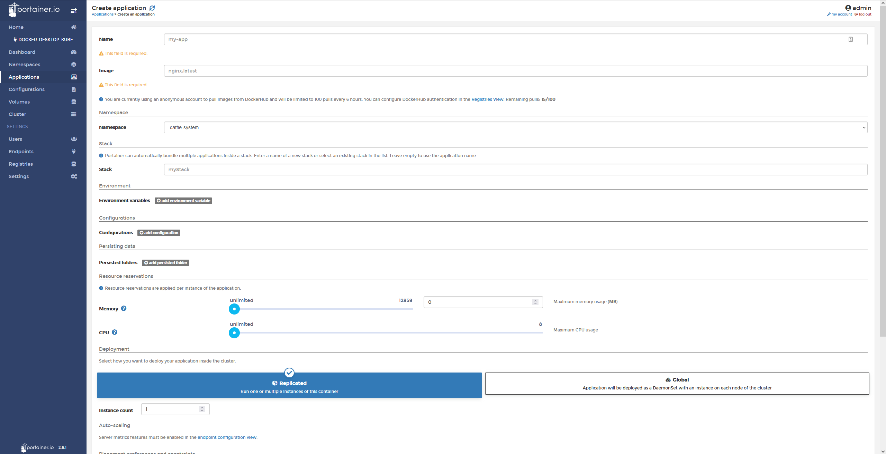

# Portianer dashboards


### First create the Portainer namespace in your cluster
```bash
kubectl create namespace portainer
```

### Using the following command, Portainer will run it
```bash
kubectl apply -n portainer -f https://raw.githubusercontent.com/portainer/k8s/master/deploy/manifests/portainer/portainer-lb.yaml
```
### Check
```bash
kubectl get pod,service,deployment -n portainer 
```
### Get Node port assigned to service
```bash
kubectl patch svc -n portainer portainer --type='json' -p '[{"op":"replace","path":"/spec/type","value":"NodePort"}]'
```

### Get Node port assigned to service
```bash
kubectl -n portainer get services portainer -o go-template='{{(index .spec.ports 0).nodePort}}'
```