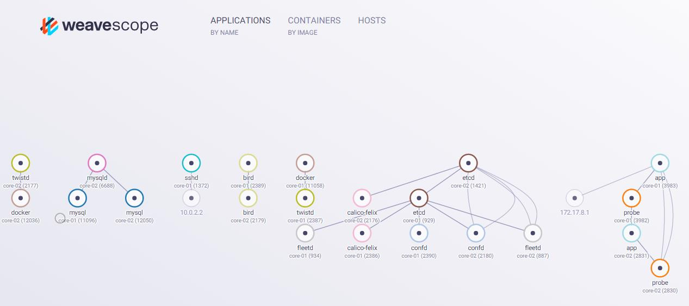

# Installing Weave Scope


### Weave Scope consists of three parts: the probe, the app and the user interface. Scope can be deployed in either a standalone configuration, where you run everything yourself, or you can use Weave Cloud, in which case only the probes run in your environment, and the app and UI are hosted by Weave Cloud.

[reference](https://www.weave.works/docs/scope/latest/installing/#k8s)

### To install Weave Scope on your Kubernetes cluster, run


```bash
kubectl apply -f "https://cloud.weave.works/k8s/scope.yaml?k8s-version=$(kubectl version | base64 | tr -d '\n')"
```

### Allowable parameters for the launcher URL:

 - v - Weave Scope version or tag, e.g. latest current release is the default
 - k8s-service-type - Kubernetes service type (for running Scope in Standalone mode), can be either LoadBalancer or NodePort, by default this is unspecified (only internal access)

## Open Scope in Your Browser
```bash
kubectl port-forward -n weave "$(kubectl get -n weave pod --selector=weave-scope-component=app -o jsonpath='{.items..metadata.name}')" 4040
```

### The URL is: http://localhost:4040.

