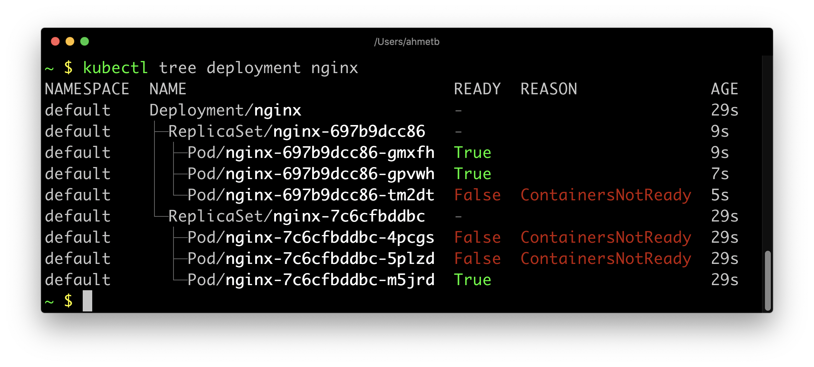
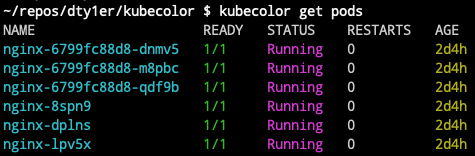

# **Kubectl tips**
# Install kubectl 
### Update the apt package index and install packages needed to use the Kubernetes apt repository:
```bash
sudo apt-get update
sudo apt-get install -y apt-transport-https ca-certificates curl
```
### Download the Google Cloud public signing key:
```bash
sudo curl -fsSLo /usr/share/keyrings/kubernetes-archive-keyring.gpg https://packages.cloud.google.com/apt/doc/apt-key.gpg
```
### Add the Kubernetes apt repository:
```bash
echo "deb [signed-by=/usr/share/keyrings/kubernetes-archive-keyring.gpg] https://apt.kubernetes.io/ kubernetes-xenial main" | sudo tee /etc/apt/sources.list.d/kubernetes.list
```
### Update apt package index with the new repository and install kubectl:
```bash
sudo apt-get update
sudo apt-get install -y kubectl
```
### check all version
```bash
apt-cache policy kubectl
````


# kubectl cmpletion

```bash
apt-get install bash-completion
```
## Enable kubectl autocompletion
```
echo 'source <(kubectl completion bash)' >>~/.bashrc
kubectl completion bash >/etc/bash_completion.d/kubect
```
## If you have an alias for kubectl, you can extend shell completion to work with that alias:
```
echo 'alias k=kubectl' >>~/.bashrc
echo 'complete -F __start_kubectl k' >>~/.bashrc
```
## Good alias
```bash
alias kg='kubectl get'
alias klo='kubectl logs -f'
```


# fzf is a general-purpose command-line fuzzy finder.
### [URL](https://github.com/junegunn/fzf#using-linux-package-managers)
### It's an interactive Unix filter for command-line that can be used with any list; files, command history, processes, hostnames, bookmarks, git commits, etc.

### Installation:
```bash
sudo apt-get install fzf
```


# Krew is the plugin manager for kubectl command-line tool.
### [URL](https://github.com/kubernetes-sigs/krew)
### Installation
```bash
(
  set -x; cd "$(mktemp -d)" &&
  OS="$(uname | tr '[:upper:]' '[:lower:]')" &&
  ARCH="$(uname -m | sed -e 's/x86_64/amd64/' -e 's/\(arm\)\(64\)\?.*/\1\2/' -e 's/aarch64$/arm64/')" &&
  curl -fsSLO "https://github.com/kubernetes-sigs/krew/releases/latest/download/krew.tar.gz" &&
  tar zxvf krew.tar.gz &&
  KREW=./krew-"${OS}_${ARCH}" &&
  "$KREW" install krew
)
```


# kubectx + kubens: Power tools for kubectl
### [URL](https://github.com/ahmetb/kubectx)
### kubectx helps you switch between clusters back and forth
### kubens helps you switch between Kubernetes namespaces smoothly
### Installation
```bash
kubectl krew install ctx
kubectl krew install ns
# OR
sudo apt install kubectx
```
### Good alias
```bash
# kubectx
alias kx=kubectx
complete -F _complete_alias kx
alias kctx="kubectl ctx"
alias kubectx="kubectl ctx"

# kubens
alias kn=kubens
complete -F _complete_alias kn
alias kns="kubectl ns"
alias kubens="kubectl ns"

```


# kube-ps1: Kubernetes prompt for bash and zsh
### [URL](https://github.com/jonmosco/kube-ps1)
### A script that lets you add the current Kubernetes context and namespace configured on kubectl to your Bash/Zsh prompt strings (i.e. the $PS1).
### add this line on ~/.zshrc
```bash
wget https://raw.githubusercontent.com/jonmosco/kube-ps1/master/kube-ps1.sh -o ~/.oh-my-zsh/plugins/kube-ps1/kube-ps1.plugin.zsh
vim ~/.zshrc
source ~/.oh-my-zsh/plugins/kube-ps1/kube-ps1.plugin.zsh
PROMPT=$PROMPT'$(kube_ps1) '
source ~/.oh-my-zsh/plugins/kubectl/kubectl.plugin.zsh
RPROMPT='%{$fg[blue]%}($ZSH_KUBECTL_PROMPT)%{$reset_color%}'
```


# Deprecations AKA KubePug - Pre UpGrade (Checker)
### [URL](https://github.com/rikatz/kubepug)
### Installation
```bash
kubectl krew install deprecations
# Usage
kubectl deprecations --help
```

# kube-shell
### [URL](https://github.com/cloudnativelabs/kube-shell)
### Under the hood kube-shell still calls kubectl. Kube-shell aims to provide ease-of-use of kubectl and increasing productivity.
### installation: 
The kube-shell requires python and pip to install. You can install the kube-shell using pip:
```bash
pip install kube-shell
```
### Usage
After installing kube-shell through pip, just run kube-shell to bring up shell.

At the kube-shell command prompt you can run exit or press F10 to exit the shell. You can clear the screen by running clear command.

By default drop-down suggestion list also displays in-line documentation, you can turn on/off inline documnetation by pressing F4 button.

You can run any shell command by prefixing command with "!". For e.g. !ls would list from the current directory.

# kail: kubernetes tail
[URL](https://github.com/boz/kail)
Kubernetes tail. Streams logs from all containers of all matched pods. Match pods by service, replicaset, deployment, and others. Adjusts to a changing cluster - pods are added and removed from logging as they fall in or out of the selection.
### Installing
Kail binaries for Linux and OSX can be found on the latest release page. Download and install into your $GOPATH/bin with:
```bash
bash <( curl -sfL https://raw.githubusercontent.com/boz/kail/master/godownloader.sh) -b "$GOPATH/bin"
```

# kubectl-tree
### [URL](https://github.com/ahmetb/kubectl-tree)
A kubectl plugin to explore ownership relationships between Kubernetes objects through ownersReferences on the objects.
The kubectl lineage plugin is very similar to kubectl tree, but it understands logical relationships between some API objects without needing ownerReferences.
### Installation:

Use krew plugin manager to install:

```bash
kubectl krew install tree
kubectl tree --help
```
## Demo



# kubecolor

[kubecolor:](https://github.com/hidetatz/kubecolor) Colorize your kubectl output
## Demo



# Others good Tips
- [kubectl-df-pv:](https://github.com/yashbhutwala/kubectl-df-pv) A kubectl plugin to see df for persistent volumes.
- [kubectl-images:](https://github.com/chenjiandongx/kubectl-images) Show container images used in the cluster
- [kurt:](https://github.com/soraro/kurt) KUbernetes Restart Tracker
- [kubent:](https://github.com/doitintl/kube-no-trouble) Easily check your clusters for use of deprecated APIs


